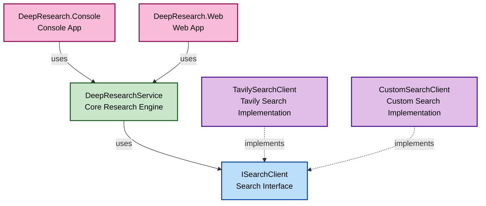

[日本語はこちら](README_ja.md)

# DeepResearch .NET

This is a .NET class library version of [Azure-Samples/deepresearch](https://github.com/Azure-Samples/deepresearch).
An AI-powered automated research system that progressively gathers information on specified topics and generates comprehensive reports.

## Overview

DeepResearch .NET is an AI-driven research tool with the following features:

- **Iterative Research**: AI autonomously generates search queries and repeats information gathering
- **Knowledge Gap Analysis**: Analyzes collected information and identifies missing parts
- **Comprehensive Report Generation**: Integrates collected information and creates structured reports
- **Real-time Progress Display**: Track each stage of research in real-time

## Directory Structure

```
DeepResearch-dotnet/
└── app/
    ├── DeepResearch.Core -----------> Core library for DeepResearch
    ├── DeepResearch.SearchClient ---> Search client for retrieving information for DeepResearch
    ├── DeepResearch.Console---------> Sample console application
    └── DeepResearch.Web-------------> Sample web application UI
```

## Prerequisites

### Required Services

1. **Azure OpenAI Service**

   - Assumes o4-mini model
   - Please note down your endpoint URL and deployment name

2. **Tavily Search API**

   - Get an API key from [Tavily](https://tavily.com/)

3. Configure various information according to the client you use:
   - **DeepResearch.Console**: See comments in Program.cs
   - **DeepResearch.Web**: For local debugging, add to appsettings.Development.json
   ```json
   {
     "OpenAI": {
       "Endpoint": "YOUR_OPENAI",
       "DeploymentName": "YOUR_DEPLOYMENT_NAME"
     },
     "Tavily": {
       "ApiKey": "YOUR_TAVILY_API_KEY"
     }
   }
   ```

## Usage

```csharp

var searchClient = new TavilySearchClient(
    new TavilyClient(
        new HttpClient(),
        Environment.GetEnvironmentVariable("TAVILY_API_KEY") ?? throw new Exception("TAVILY_API_KEY is not set.")
    )
);

var ChatClient = new AzureOpenAIClient(
    new Uri(Environment.GetEnvironmentVariable("AOAI_BASE_URL") ?? throw new Exception("AOAI_BASE_URL is not set.")),
    new DefaultAzureCredential()
).GetChatClient("o4-mini");

void OnProgressChanged(ProgressBase progress)
{
  // Handle progress updates here
}

var options = new DeepResearchOptions
{
    MaxResearchLoops = 3, // Maximum number of loops
    MaxCharacterPerSource = 1000, // Maximum character count per source
    MaxSourceCountPerSearch = 5, // Maximum number of sources per search
    EnableSummaryConsolidation = true // A flag indicating whether to integrate all step summaries into the final answer. If set to True, adjust the above three parameters with consideration for the context length limit.
};

Console.WriteLine("Deep Research Console");
Console.WriteLine("====================");
Console.Write("Enter the topic you want to research: ");
var researchTopic = Console.ReadLine();

var service = new DeepResearchService(ChatClient, searchClient, OnProgressChanged, options);
var result = await service.RunResearchAsync(researchTopic, CancellationToken.None);

Console.WriteLine("\n" + new string('=', 50));
Console.WriteLine("📋 Research Results");
Console.WriteLine(new string('=', 50));
Console.WriteLine(result.Summary);

Console.WriteLine("\nPress any key to exit...");
Console.ReadKey();
```

## Return Values and Progress Notifications

DeepResearchService returns a ResearchResult object when the research is completed.
This object contains the research summary and related information.

- ResearchTopic: The topic of the research
- Summary: The final research report
- Sources: List of information collected during the research
- Images: List of images collected during the research

Additionally, by specifying the onProgressChanged callback in the DeepResearchService constructor arguments, you can receive real-time notifications of the research status.
Progressive notifications are defined as classes for each step that inherit from ProgressBase.

- QueryGenerationProgress: Notification class for query generation completion
- WebResearchProgress: Notification class for web search completion
- SummarizeProgress: Notification class for search result summarization completion
- ReflectionProgress: Notification class for knowledge gap analysis completion
- RoutingProgress: Notification class for next process determination completion
- FinalizeProgress: Notification class for research report creation start
- ResearchCompleteProgress: Notification class for research report creation completion
- ErrorProgress: Notification class for errors that occur during research

For example, you can receive and handle notification classes as follows:

```csharp
void OnProgressChanged(ProgressBase progress)
{
    switch (progress)
    {
        case QueryGenerationProgress queryProgress:
            Console.WriteLine($"Query generated: {queryProgress.Query}");
            Console.WriteLine($"Query generation rationale: {queryProgress.Rationale}");
            break;
        case WebResearchProgress webProgress:
            Console.WriteLine($"Web search completed: Retrieved {webProgress.Sources.Count} sources");
            Console.WriteLine($"Web search completed: Retrieved {webProgress.Images.Count} images");
            break;
        case SummarizeProgress summarizeProgress:
            Console.WriteLine($"Summary: {summarizeProgress.Summary}");
            break;
        case ReflectionProgress reflectionProgress:
            Console.WriteLine("Reflection completed");
            Console.WriteLine($"Knowledge gap: {reflectionProgress.KnowledgeGap}");
            Console.WriteLine($"Additional search query: {reflectionProgress.Query}");
            break;
        case RoutingProgress routingProgress:
            Console.WriteLine($"Route decision: {routingProgress.Decision}");
            Console.WriteLine($"Loop iteration count: {routingProgress.LoopCount}");
            break;
        case FinalizeProgress finalizeProgress:
            Console.WriteLine("Creating final report...");
            break;
        case ResearchCompleteProgress completeProgress:
            Console.WriteLine("Research completed");
            Console.WriteLine($"Final Summary: {completeProgress.FinalSummary}");
            Console.WriteLine($"Reference information: {string.Join(", ", completeProgress.Sources)}");
            Console.WriteLine($"Images: {string.Join(", ", completeProgress.Images)}");
            break;
        case ErrorProgress errorProgress:
            Console.WriteLine($"An error occurred: {errorProgress.Message}");
            break;
        default:
            Console.WriteLine("Unknown notification type");
            break;
    }
}
```

## Sample Clients

### Console App

The [DeepResearch.Console](/app/DeepResearch.Console/) project contains a sample console application.


### Web App

The [DeepResearch.Web](/app/DeepResearch.Web/) project contains a sample web application using Blazor.


Demo video: https://youtu.be/J49-Pywa2EM?si=Gdv5kisPSaMUq3W_

## Extensions

By implementing your own search client that implements the ISearchClient interface defined in DeepResearch.SearchClient, you can easily add searches for other data sources such as internal company information or specific databases, not just web searches.


