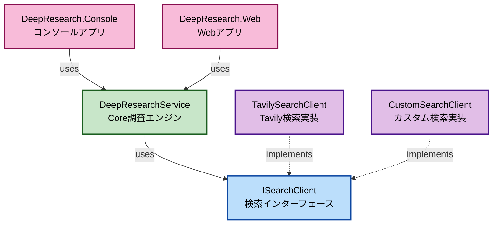

[English is here ](README.md)

# DeepResearch .NET

[Azure-Samples/deepresearch](https://github.com/Azure-Samples/deepresearch)の.NET 版クラスライブラリです。
AI を活用した自動リサーチシステムで、指定されたトピックについて段階的に情報収集し、包括的なレポートを生成します。

## 概要

DeepResearch .NET は、以下の特徴を持つ AI 駆動の調査ツールです：

- **反復的リサーチ**: AI が自律的に検索クエリを生成し、情報収集を繰り返します
- **知識ギャップ分析**: 収集した情報を分析し、不足している部分を特定します
- **包括的レポート生成**: 収集した情報を統合し、構造化されたレポートを作成します
- **リアルタイム進行状況表示**: 調査の各段階をリアルタイムで追跡できます

## ディレクトリ構成

```
DeepResearch-dotnet/
└── app/
    ├── DeepResearch.Core -----------> DeepResearchのコアライブラリ
    ├── DeepResearch.SearchClient ---> DeepResearchを行うために情報を取得するための検索クライアント
    ├── DeepResearch.Console---------> サンプルのコンソールアプリケーション
    └── DeepResearch.Web-------------> サンプルのWebアプリケーションのUI
```

## 事前準備

### 必要なサービス

1. **Azure OpenAI Service**

   - o4-mini モデルを想定しています
   - エンドポイント URL とデプロイメント名を控えておいてください

2. **Tavily Search API**

   - [Tavily](https://tavily.com/)で API キーを取得してください

3. 使用するクライアントに応じて各種情報を設定します。
   - **DeepResearch.Console** : Program.cs のコメント参照。
   - **DeepResearch.Web** : ローカルデバッグ時は appsettings.Development.json に記載
   ```json
   {
     "OpenAI": {
       "Endpoint": "YOUR_OPENAI",
       "DeploymentName": "YOUR_DEPLOYMENT_NAME"
     },
     "Tavily": {
       "ApiKey": "YOUR_TAVILY_API_KEY"
     }
   }
   ```

## 使い方

```csharp

var searchClient = new TavilySearchClient(
    new TavilyClient(
        new HttpClient(),
        Environment.GetEnvironmentVariable("TAVILY_API_KEY") ?? throw new Exception("TAVILY_API_KEY is not set.")
    )
);

var ChatClient = new AzureOpenAIClient(
    new Uri(Environment.GetEnvironmentVariable("AOAI_BASE_URL") ?? throw new Exception("AOAI_BASE_URL is not set.")),
    new DefaultAzureCredential()
).GetChatClient("o4-mini");

void OnProgressChanged(ProgressBase progress)
{
  // Handle progress updates here
}

var options = new DeepResearchOptions
{
    MaxResearchLoops = 3, // 最大ループ数
    MaxCharacterPerSource = 1000, // ソースごとの最大文字数
    MaxSourceCountPerSearch = 5 // 検索ごとの最大ソース数
};

Console.WriteLine("Deep Research Console");
Console.WriteLine("====================");
Console.Write("調査したいトピックを入力してください: ");
var researchTopic = Console.ReadLine();

var service = new DeepResearchService(ChatClient, searchClient, OnProgressChanged, options);
var result = await service.RunResearchAsync(researchTopic, CancellationToken.None);

Console.WriteLine("\n" + new string('=', 50));
Console.WriteLine("📋 調査結果");
Console.WriteLine(new string('=', 50));
Console.WriteLine(result.Summary);

Console.WriteLine("\nPress any key to exit...");
Console.ReadKey();
```

## 戻り値と逐次通知

DeepResearchService は、調査が完了した際に ResearchResult 型のオブジェクトを返します。
このオブジェクトには、調査の要約や関連する情報が含まれています。

- ResearchTopic : 調査対象のトピック
- Summary : 調査の最終レポート
- Sources : 調査中に収集された情報のリスト
- Images : 調査中に収集された画像のリスト

また、DeepResearchService のコンストラクタ引数で onProgressChanged コールバックを指定することで、調査の通知状況をリアルタイムで受け取ることができます。
逐次通知は ProgressBase を継承した各ステップごとのクラスが定義されています。

- QueryGenerationProgress: クエリ生成完了の通知クラス
- WebResearchProgress: Web 検索完了の通知クラス
- SummarizeProgress: 検索結果の要約完了の通知クラス
- ReflectionProgress: 知識ギャップの補完完了の通知クラス
- RoutingProgress: 次の処理の判定完了の通知クラス
- FinalizeProgress: 調査レポートの作成開始の通知クラス
- ResearchCompleteProgress: 調査レポートの作成完了の通知クラス
- ErrorProgress: 調査中にエラーが発生した際の通知クラス

例えば以下のように通知クラスを受けとってハンドルすることができます。

```csharp
void OnProgressChanged(ProgressBase progress)
{
    switch (progress)
    {
        case QueryGenerationProgress queryProgress:
            Console.WriteLine($"クエリを生成: {queryProgress.Query}");
            Console.WriteLine($"クエリ生成の理由: {queryProgress.Rationale}");
            break;
        case WebResearchProgress webProgress:
            Console.WriteLine($"Web検索完了： {webProgress.Sources.Count} 件のソースを取得");
            Console.WriteLine($"Web検索完了： {webProgress.Images.Count} 枚の画像を取得");
            break;
        case SummarizeProgress summarizeProgress:
            Console.WriteLine($"要約: {summarizeProgress.Summary}");
            break;
        case ReflectionProgress reflectionProgress:
            Console.WriteLine("リフレクション完了");
            Console.WriteLine($"知識ギャップ: {reflectionProgress.KnowledgeGap}");
            Console.WriteLine($"追加検索クエリ: {reflectionProgress.Query}");
            break;
        case RoutingProgress routingProgress:
            Console.WriteLine($"ルートの決定 {routingProgress.Decision}");
            Console.WriteLine($"ループ思考回数 {routingProgress.LoopCount}");
            break;
        case FinalizeProgress finalizeProgress:
            Console.WriteLine("最終レポートの作成中.");
            break;
        case ResearchCompleteProgress completeProgress:
            Console.WriteLine("調査の完了");
            Console.WriteLine($"Final Summary: {completeProgress.FinalSummary}");
            Console.WriteLine($"参考情報: {string.Join(", ", completeProgress.Sources)}");
            Console.WriteLine($"画像: {string.Join(", ", completeProgress.Images)}");
            break;
        case ErrorProgress errorProgress:
            Console.WriteLine($"エラーが発生しました。: {errorProgress.Message}");
            break;
        default:
            Console.WriteLine("不明な通知型");
            break;
    }
}
```

## サンプルクライアント

### コンソールアプリ

[DeepResearch.Console](/app/DeepResearch.Console/) プロジェクトには、コンソールアプリケーションのサンプルが含まれています。


### Web アプリ

[DeepResearch.Web](/app/DeepResearch.Web/) プロジェクトには、Blazor を使用した Web アプリケーションのサンプルが含まれています


動作デモ：https://youtu.be/J49-Pywa2EM?si=Gdv5kisPSaMUq3W_

## 拡張

DeepResearch.SearchClient で定義された ISearchClient インターフェースを実装した独自の検索クライアントを実装することで、Web 検索だけでなく社内情報や特定のデータベスなど、他のデータソース検索を簡単に追加できます。


