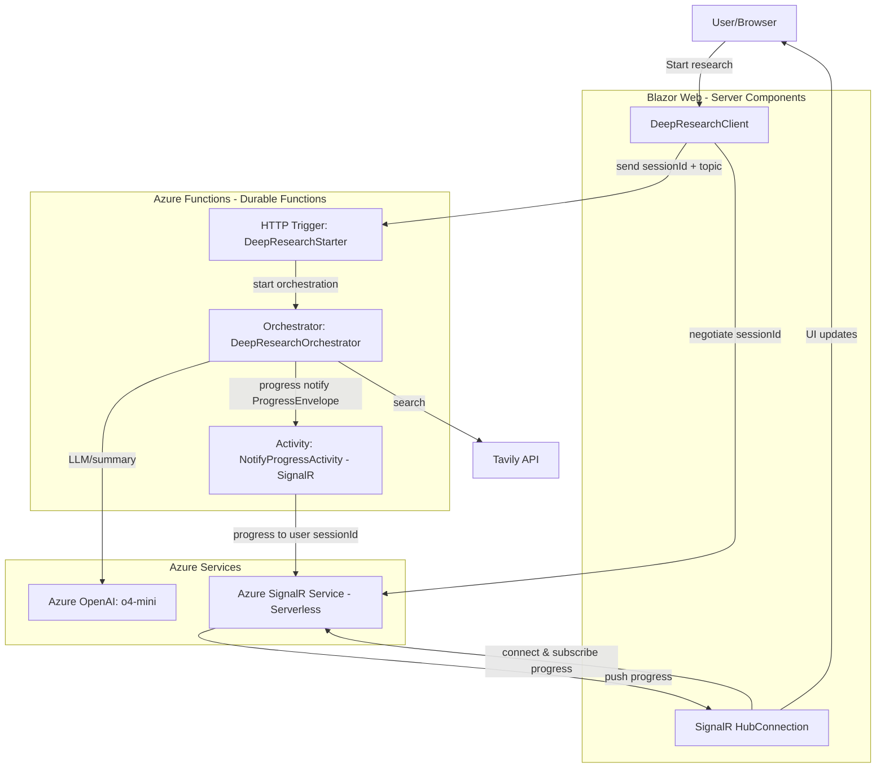

# DeepResearch Durable Functions (.NET Aspire)

This directory hosts a .NET Aspire application composed of:

- DeepResearch.DurableFunctions: Azure Functions (Durable Functions, .NET isolated) backend that orchestrates DeepResearch end-to-end
- DeepResearch.DurableFunctions.Web: ASP.NET Core Blazor frontend that starts research and displays real-time progress
- DeepResearch.DurableFunctions.AppHost: Aspire AppHost that wires services, connection strings, and parameters

Durable Functions is useful when the research requires many iterations or longer runtime. It provides durable orchestration, retries, and robust progress streaming via Azure SignalR Service.

## Architecture overview

- Orchestrator: `DeepResearchOrchestrator` orchestrates the workflow
- Starter HTTP function: `DeepResearchStarter` schedules a new orchestration instance
- Progress streaming: `NotifyProgressActivity` pushes `ProgressEnvelope` to a SignalR user
- Web client: `DeepResearchClient` (Blazor) subscribes to SignalR and yields `ProgressBase` stream
- Aspire wiring: `AppHost.cs` provides connection strings and parameters to the Functions app and the Web app

Key files:

- `DeepResearch.DurableFunctions/Program.cs`: DI, AOAI client, Tavily client, SignalR hub registration
- `DeepResearch.DurableFunctions/DeepResearchStarter.cs`: HTTP trigger to start orchestration
- `DeepResearch.DurableFunctions/DeepResearchOrchestrator.cs`: core orchestration logic
- `DeepResearch.DurableFunctions/SignalR/NotifyProgressActivity.cs`: SignalR negotiate/activity for progress push
- `DeepResearch.DurableFunctions.Web/Program.cs`: Web host and typed client wiring
- `DeepResearch.DurableFunctions.Web/Client/DeepResearchClient.cs`: start + stream progress
- `DeepResearch.DurableFunctions.AppHost/AppHost.cs`: Aspire composition

## Prerequisites

- .NET 9 SDK
- Azure AI Foundry with Azure OpenAI
  - An Azure OpenAI resource with an o4-mini deployment created in Azure AI Foundry
  - Endpoint URL (used as `ConnectionStrings:aoai`)
  - Managed identity authentication: assign the hosting identity (for example, the Functions app's managed identity) the role "Cognitive Services OpenAI User" on the Azure OpenAI resource. This is the minimum role required to call inference APIs
    - Docs: Authenticate to Azure OpenAI from an Azure hosted app → Add an Azure OpenAI user role to the identity (Cognitive Services OpenAI User)
      https://learn.microsoft.com/en-us/dotnet/ai/how-to/app-service-aoai-auth#add-an-azure-openai-user-role-to-the-identity
- Azure SignalR Service (Serverless mode) and its connection string (`AzureSignalRConnectionString`)
- Tavily API key

## Configuration (using .NET user secrets)

Store secrets in the Functions project user secrets instead of appsettings files.

Set the following keys for the project `app/DurableFunctions/DeepResearch.DurableFunctions/DeepResearch.DurableFunctions.csproj`:

```powershell
# Azure OpenAI endpoint (as ConnectionStrings)
 dotnet user-secrets set --project .\app\DurableFunctions\DeepResearch.DurableFunctions\DeepResearch.DurableFunctions.csproj "ConnectionStrings:aoai" "https://<your-aoai-endpoint>.openai.azure.com/"

# Azure SignalR connection string (used by SignalR bindings)
 dotnet user-secrets set --project .\app\DurableFunctions\DeepResearch.DurableFunctions\DeepResearch.DurableFunctions.csproj "AzureSignalRConnectionString" "Endpoint=https://<your-signalr>.service.signalr.net;AccessKey=<key>;Version=1.0;"

# DeepResearch options
 dotnet user-secrets set --project .\app\DurableFunctions\DeepResearch.DurableFunctions\DeepResearch.DurableFunctions.csproj "DeepResearchAppOptions:AzureOpenAIDeploymentName" "o4-mini"
 dotnet user-secrets set --project .\app\DurableFunctions\DeepResearch.DurableFunctions\DeepResearch.DurableFunctions.csproj "DeepResearchAppOptions:TavilyApiKey" "<your-tavily-api-key>"
```

The Functions app binds these values in `Program.cs` using `DeepResearchAppOptions`.


Notes:
- `AddAzureOpenAIClient("aoai")` reads the AOAI endpoint from `ConnectionStrings:aoai`.
- SignalR extension uses `AzureSignalRConnectionString` by default.
- `DeepResearchAppOptions` binds `AzureOpenAIDeploymentName` and `TavilyApiKey` from configuration.
## Run with Visual Studio 2022

1) Open the solution `app/DeepResearch.sln` in Visual Studio 2022.
2) Set startup project to `DeepResearch.DurableFunctions.AppHost`.
3) Run (F5). The Aspire AppHost will boot the Functions backend and the Blazor web frontend. Use the Aspire dashboard to navigate to the web UI.

## Run with .NET CLI

1) Ensure prerequisites are ready and fill `appsettings.json` under `DeepResearch.DurableFunctions.AppHost/`.

2) Start the Aspire AppHost from the solution root of this directory:

```powershell
# from app/DurableFunctions
dotnet run --project .\DeepResearch.DurableFunctions.AppHost\DeepResearch.DurableFunctions.AppHost.csproj
```

- The AppHost will start both:
  - Functions backend (Durable Functions)
  - Blazor web frontend
- Service discovery is handled by Aspire; the web app calls the Functions app via logical service name `deepresearch-durablefunctions`.

3) Open the web UI

- The AppHost dashboard will show the web app URL. Navigate there and start a research job from the UI.

## Start via HTTP (manual)

You can also start an orchestration by calling the starter function directly during development. The default dev port for Functions may differ on your machine; adjust the URL accordingly.

Example request body:

```json
{
  "sessionId": "user-123",
  "topic": "What's new in .NET 9?",
  "maxResearchLoops": 4
}
```

Example (PowerShell):

```powershell
$body = @{ sessionId = "user-123"; topic = ".NET 9 new features"; maxResearchLoops = 3 } | ConvertTo-Json
Invoke-RestMethod -Method Post -Uri "http://localhost:7283/api/DeepResearchStarter" -ContentType 'application/json' -Body $body
```

The response includes HTTP management URLs you can poll (e.g., runtime status API).

## Real-time progress

- The Functions orchestration emits progress via `NotifyProgressActivity` to Azure SignalR Service.
- The Blazor app establishes a SignalR connection and receives `ProgressEnvelope` messages.
- `DeepResearchClient.StartDeepResearchAsync` returns an IAsyncEnumerable<ProgressBase> for easy consumption and UI updates.

> Note (important)
> The Azure Functions SignalR binding in Serverless mode sends via REST and enforces a ~1 MB request body limit (and ~16 KB for headers). If an intermediate progress or final result payload exceeds 1 MB, you can see `AzureSignalRRuntimeException` with an inner 413 Request Entity Too Large.

## Architecture diagram

The diagram below shows how the Blazor web app, Durable Functions backend, Azure OpenAI, Azure SignalR, and the browser user interact.



## Troubleshooting

 - 404 on `orchestrations/{instanceId}`: the instance ID is wrong or the Functions port differs. Check the starter response payload and the Functions console logs.
 - No progress updates in UI: verify SignalR connection, check browser devtools console, and Functions logs for `NotifyProgressActivity`.
 - HTTP 400 when starting: ensure `topic` is provided and not empty; `sessionId` must be included for progress routing.
