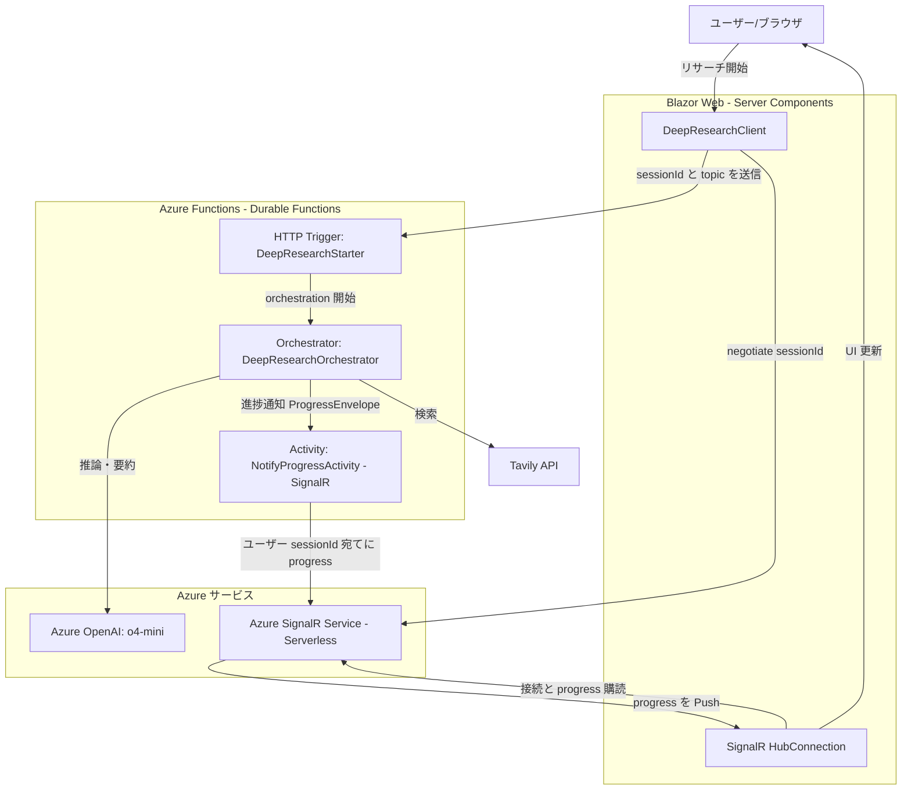

# DeepResearch Durable Functions（.NET Aspire）

このディレクトリには .NET Aspire による以下の構成が含まれます。

- DeepResearch.DurableFunctions: Azure Functions（Durable Functions、.NET Isolated）で DeepResearch のオーケストレーションを実行
- DeepResearch.DurableFunctions.Web: ASP.NET Core Blazor（Server Components）のフロントエンド。リサーチ開始と進捗表示を担当
- DeepResearch.DurableFunctions.AppHost: Aspire AppHost。各サービスの接続情報・パラメーターを束ねて起動

Durable Functions は、長時間・多イテレーションのリサーチに向いており、耐久的なオーケストレーション、リトライ、Azure SignalR を使った堅牢な進捗配信を提供します。

## アーキテクチャ概要

- Orchestrator: `DeepResearchOrchestrator` がワークフロー全体を統括
- Starter HTTP Function: `DeepResearchStarter` がオーケストレーションを起動
- 進捗配信: `NotifyProgressActivity` が `ProgressEnvelope` をユーザーに Push（Azure SignalR）
- Web クライアント: `DeepResearchClient`（Blazor）が SignalR に接続し、`IAsyncEnumerable<ProgressBase>` として進捗を消費
- Aspire 構成: `AppHost.cs` で Functions/Web を束ね、接続文字列とパラメーターを注入

主なファイル:

- `DeepResearch.DurableFunctions/Program.cs`: DI 構成、Azure OpenAI/Tavily/SignalR の登録
- `DeepResearch.DurableFunctions/DeepResearchStarter.cs`: HTTP でオーケストレーションを開始
- `DeepResearch.DurableFunctions/DeepResearchOrchestrator.cs`: オーケストレーション本体
- `DeepResearch.DurableFunctions/SignalR/NotifyProgressActivity.cs`: SignalR のネゴシエーション/進捗送信
- `DeepResearch.DurableFunctions.Web/Program.cs`: Web ホストとクライアントの設定
- `DeepResearch.DurableFunctions.Web/Client/DeepResearchClient.cs`: オーケストレーション開始＋進捗ストリーム
- `DeepResearch.DurableFunctions.AppHost/AppHost.cs`: Aspire の合成

## 前提条件

- .NET 9 SDK
- Azure AI Foundry（Azure OpenAI）
  - Azure AI Foundry 上で o4-mini をデプロイした Azure OpenAI リソース
  - エンドポイント URL（`ConnectionStrings:aoai` に設定）
  - マネージド ID 認証: ホスティング側の ID（例: Functions のマネージド ID）に Azure OpenAI リソースに対する「Cognitive Services OpenAI User」ロールを割り当ててください（推論 API 呼び出しに最低限必要な権限）
    - 参考: Azure ホストアプリからの認証（Cognitive Services OpenAI User の割り当て）
      https://learn.microsoft.com/ja-jp/dotnet/ai/how-to/app-service-aoai-auth#add-an-azure-openai-user-role-to-the-identity
- Azure SignalR Service（Serverless モード）と接続文字列（`AzureSignalRConnectionString`）
- Tavily API キー

## 設定（.NET ユーザーシークレットの使用）

設定値は appsettings ではなく、Functions プロジェクトのユーザーシークレットに保存することを推奨します。

以下のキーを設定してください（PowerShell 例、任意のディレクトリからプロジェクトを指定して実行可能）：

```powershell
# Azure OpenAI エンドポイント（ConnectionStrings として）
 dotnet user-secrets set --project .\app\DurableFunctions\DeepResearch.DurableFunctions\DeepResearch.DurableFunctions.csproj "ConnectionStrings:aoai" "https://<your-aoai-endpoint>.openai.azure.com/"

# Azure SignalR の接続文字列（SignalR バインディングで使用）
 dotnet user-secrets set --project .\app\DurableFunctions\DeepResearch.DurableFunctions\DeepResearch.DurableFunctions.csproj "AzureSignalRConnectionString" "Endpoint=https://<your-signalr>.service.signalr.net;AccessKey=<key>;Version=1.0;"

# DeepResearch のオプション
 dotnet user-secrets set --project .\app\DurableFunctions\DeepResearch.DurableFunctions\DeepResearch.DurableFunctions.csproj "DeepResearchAppOptions:AzureOpenAIDeploymentName" "o4-mini"
 dotnet user-secrets set --project .\app\DurableFunctions\DeepResearch.DurableFunctions\DeepResearch.DurableFunctions.csproj "DeepResearchAppOptions:TavilyApiKey" "<your-tavily-api-key>"
```


補足:
- `AddAzureOpenAIClient("aoai")` は `ConnectionStrings:aoai` からエンドポイントを読み込みます。
- SignalR 拡張は既定で `AzureSignalRConnectionString` を参照します。
- `DeepResearchAppOptions` は `AzureOpenAIDeploymentName` と `TavilyApiKey` をバインドします。
## Visual Studio 2022 での実行

1) Visual Studio 2022 で `app/DeepResearch.sln` を開きます。
2) スタートアッププロジェクトに `DeepResearch.DurableFunctions.AppHost` を選択します。
3) 実行（F5）。Aspire AppHost が起動し、Functions と Web が立ち上がります。Aspire のダッシュボードから Web UI にアクセスできます。


## .NET CLI での実行

1) 上記の前提・設定を行います。

2) AppHost を起動します（このディレクトリ直下で実行する例）：

```powershell
# 実行場所: app/DurableFunctions
dotnet run --project .\DeepResearch.DurableFunctions.AppHost\DeepResearch.DurableFunctions.AppHost.csproj
```

- AppHost は次を起動します：
  - Functions（Durable Functions）
  - Blazor Web フロントエンド
- サービスディスカバリーは Aspire が処理し、Web から Functions へ論理名 `deepresearch-durablefunctions` でアクセスします。

3) Web UI を開きます

- AppHost のダッシュボードに表示される Web アプリの URL にアクセスし、UI からリサーチを開始します。

## HTTP での手動起動（開発時）

開発中はスタータ関数を直接叩いて起動できます。ポートは環境により異なるため、Functions の起動ログで確認してください。

リクエストボディ例:

```json
{
  "sessionId": "user-123",
  "topic": ".NET 9 の新機能は？",
  "maxResearchLoops": 4
}
```

PowerShell 例:

```powershell
$body = @{ sessionId = "user-123"; topic = ".NET 9 の新機能"; maxResearchLoops = 3 } | ConvertTo-Json
Invoke-RestMethod -Method Post -Uri "http://localhost:7283/api/DeepResearchStarter" -ContentType 'application/json' -Body $body
```

レスポンスには HTTP 管理 URL（ステータスなど）が含まれます。

## リアルタイム進捗

- Functions のオーケストレーションは `NotifyProgressActivity` を通じて Azure SignalR に進捗を Push します。
- Blazor アプリは SignalR 接続を確立し、`ProgressEnvelope` を受信します。
- `DeepResearchClient.StartDeepResearchAsync` は `IAsyncEnumerable<ProgressBase>` を返すため、UI の逐次更新が容易です。

> 注記（重要）
> Azure Functions の SignalR バインド（Serverless/REST 経由）はメッセージ本文の上限が約 1 MB（ヘッダー 16 KB）です。途中経過や最終結果のペイロードが 1 MB を超えると、`AzureSignalRRuntimeException`（内側は 413 Request Entity Too Large）が発生します。

## アーキテクチャ関連図

以下は Blazor（サーバーコンポーネント）と Durable Functions、Azure OpenAI、Azure SignalR、ブラウザユーザー間のやり取りを示す簡略図です。



## トラブルシューティング

 - `orchestrations/{instanceId}` が 404: インスタンス ID が誤っているか、Functions のポートが異なります。スタータの応答と Functions のログを確認してください。
 - UI に進捗が出ない: SignalR 接続が成立しているか、ブラウザのコンソールと Functions の `NotifyProgressActivity` ログを確認してください。
 - 起動時 400: `topic` が空でないか、`sessionId` を含めているかを確認してください。
